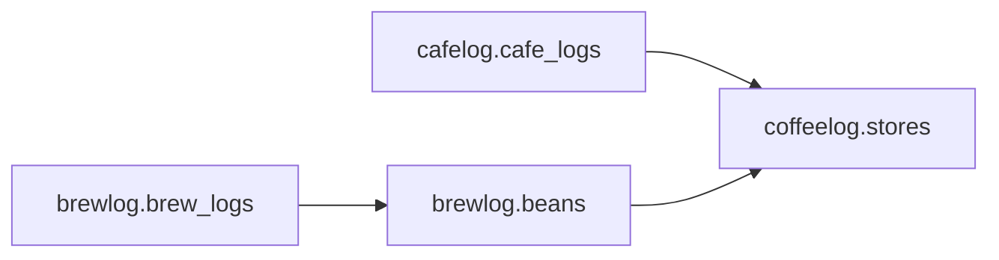

# 店舗情報の共有 (Issue #88)

店舗名・都道府県・最大10件のリンクは共通の `coffeelog.stores` テーブルで管理する。Cafelogの来店記録は必須の `store_id`、Brewlogのスペシャルティの豆は任意の `store_id` で関連付ける。抽出記録は豆を経由して店舗へ関連付く。



スキーマ定義と店舗の保存・履歴取得処理は `packages/database` に置く。アプリの `db/schema.ts` は各スキーマを再公開し、それぞれのDrizzle移行履歴を維持する。共通店舗テーブルには独立した移行履歴がある。

## 登録・表示

- Cafelogは店舗名・都道府県・リンクを入力する既存の記録フォームを維持する。店舗名の候補から選ぶと登録済みの情報を補完する。保存時に店舗を解決し、来店記録と同じトランザクションで保存する。
- Brewlogはスペシャルティの豆フォームで「登録しない」「登録済みの店舗」「新しいお店を登録」を選べる。新規店舗の入力欄は同じフォーム内にある。豆の編集・バージョン追加でも関連を保持し、レギュラーへ変更すると店舗との関連を解除する。レギュラーの購入店の自由入力は従来どおり。
- 両アプリの設定画面から店舗一覧を開ける。Cafelogの記録詳細、Brewlogの豆詳細からも店舗へ移動できる。店舗画面には来店時のコーヒー属性・感想と、その店の豆の抽出条件・評価を表示する。
- 店舗の公開情報は両アプリの認証済み利用者で共有する。来店記録は認証済みのLINEユーザー本人、抽出記録はそのユーザーのBrewlogプロフィールに紐付く世帯だけを返す。Cafelogのみ利用している場合は抽出履歴を空で返す。両アプリで同じ人物の履歴を共有するには、同じLINE ProviderのユーザーIDを使う必要がある。
- 店舗名の前後の空白・大文字小文字と都道府県をキーに重複を防ぐ。同名店舗が一つだけで、どちらかの都道府県が未登録なら同じIDを再利用し、不足情報を補完する。同名店舗が複数ある場合は都道府県を推測しない。同じ都道府県にある別支店は店舗名に支店名を含める。
- 店舗のリンクは共通情報なので、Cafelogで既存店舗のリンクを編集すると関連する記録にも反映される。新しい記録でリンクを省略しても既存リンクは消さない。アーカイブ済み・削除済みの豆の抽出履歴も保持する。

## データを保つ移行

1. 共通の店舗テーブルを作成する。
2. 既存のCafelog記録を店舗名・都道府県ごとにまとめ、店舗IDで関連付ける。http(s)のリンクを重複除去して最大10件引き継ぐ。空白の店舗名には「店舗名未登録」を用いる。
3. 既存のスペシャルティの購入店は、同名店舗が一つならそのIDを使う。店舗が未登録、または同名店舗が複数なら都道府県未登録の店舗を用いる。レギュラーの購入店はそのまま保つ。

元の `cafe_name`・`cafe_url`・`prefecture`・`cafe_log_links` と `purchase_store` は削除せず、移行前の情報をすべて残す。新しいCafelog記録では店舗情報を旧カラムへ書き込まない。APIは店舗テーブルから読み、従来の `cafeName`・`prefecture`・`links` のレスポンス形式へ変換する。

```sh
pnpm --filter @yahatapp/database db:generate
pnpm --filter cafelog db:generate
pnpm --filter brewlog db:generate
pnpm db:migrate
```

移行コマンドには両アプリが利用する同じSupabase DBの `DATABASE_URL` を渡す。各アプリの既存の `db:migrate` コマンドでも、共通 → Cafelog → Brewlogの順に適用する。Drizzleが生成するSQL・ハッシュ・ジャーナルと既存の移行テーブルを使い、全体を一つのトランザクションに収める。トランザクションのadvisory lockで二つのデプロイが同時に移行を適用することを防ぎ、失敗時は全体を戻す。Supabaseのtransaction poolerでも同じ接続を保持できる。

初回リリースでは、移行前のWorkerが新しいCafelog記録を追加しないよう、記録の書き込みを止めてから移行し、両Workerを更新して再開する。移行後は旧Workerへ単独で戻すことはできないため、問題があれば保存済みの旧カラムを使って互換性を回復する修正を行う。

## 検証

PostgreSQL互換のPGliteで既存スキーマと記録を作り、店舗への移行・リンク保持・同名支店の扱い・トランザクションのロールバック・本人/世帯への絞り込みを検証する。両アプリのAPIテストでは、既存形式のCafelog登録、豆の店舗登録・選択・解除、関連を含む取得、入力検証を確認する。既存の認証境界テストは店舗APIも対象とする。
